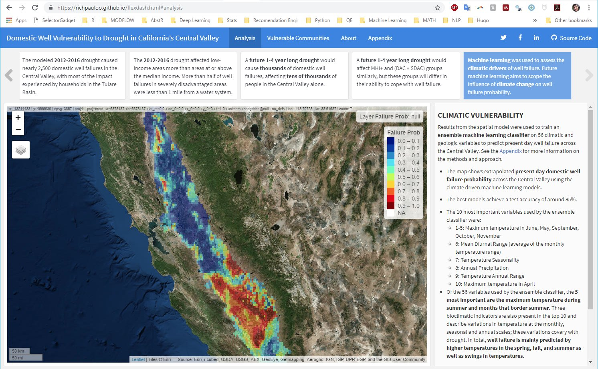

# ABOUT

This repo holds scripts used in the analysis submitted to the 2018 [California Water Data Challenge](http://waterchallenge.data.ca.gov/).  

[The final project can be found online here](richpauloo.github.io/flexdash.html).  

  

# TEAM

*function(water, data){science}* is a team of [Hydrology](https://www.hsgg.ucdavis.edu/) and [Geography](https://geography.ucdavis.edu/) PhDs and PhD Candidates at UC Davis and the [Public Policy Institute of California](http://www.ppic.org/). It includes:  

* Amanda Fencl, PhD Candidate   
* Rich Pauloo, PhD  Candidate  
* Hervé Guillon, PhD    
* Alvar Escriva-Bou, PhD  

# CONTACT

Please contact Rich Pauloo [rpauloo at ucdavis dot edu] if you have any questions about this project.  
