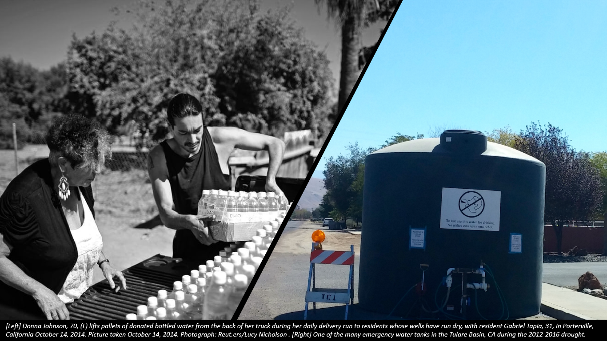
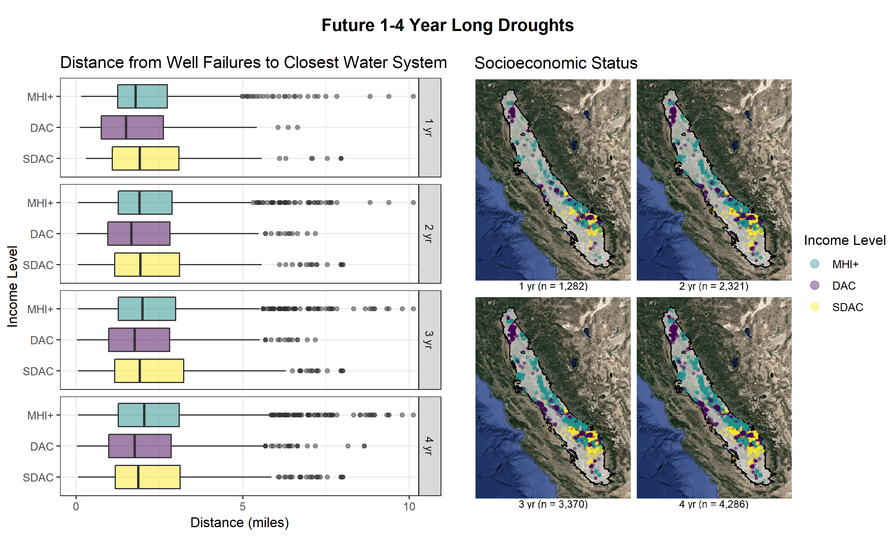
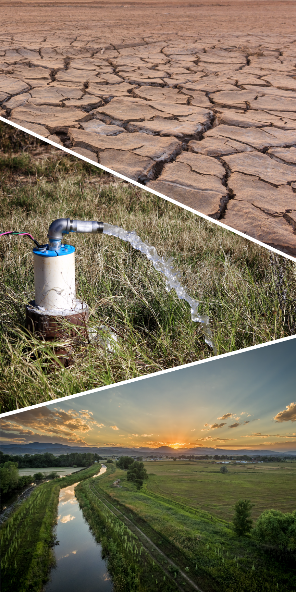

Analysis {.storyboard}
=========================================

```{r setup, include=FALSE}
library(flexdashboard)
library(sf)
library(sp)
library(readr)
library(colormap)
library(leaflet)
library(here)

# load data from`06_calibration_herve.Rmd`
# b118cvsf      <- read_rds("b118cvsf.rds")
# gsacvsf       <- read_rds("gsacvsf_simp.rds") # simplified by rmapshaper
# domcv5ll_dry  <- read_rds("domcv5ll_dry.rds")
# domcv5ll_wet  <- read_rds("domcv5ll_wet.rds")
# icons_dry     <- read_rds("icons_dry.rds")
# icons_wet     <- read_rds("icons_wet.rds")
# 
# # public water system boundaries
# ws <- read_rds(here("data","public_water_systems",
#                     "service_areas_in_cv_sf.rds"))
```

### Climate change, drought, and the overexplotation of aquifers lowers groundwater levels and increases the risk of domestic well failure.  {data-commentary-width=400}

```{r, out.width = '100%'}

```

***

#### **BACKGROUND & MOTIVATION**

- California's Central Valley is the state's most agriculturally intensive region and heavily dependent on groundwater. It is also home to the state's largest population of domestic well reliant communities.  

- During the 2012-2016 drought, approximately **2,500** domestic wells failed in the Central Valley leaving tens of thousands of people without a reliable source of drinking water, which drew national attention and federal intervention.

- Hundreds of thousands upwards to a million Californians rely on domestic wells for drinking water.  

#### **QUESTIONS**

- How will a 1, 2, 3 or 4 year long drought affect domestic well failure in California's Central Valley?

- Are well failures more associated with particular social factors (i.e. - median income, ethnicity)? 

- Can machine learning models predict domestic well failure from climatological variables, and if so, what does climate change imply for domestic well vulnerability?


### Spatial and machine learning models driven by open data from public agencies were used to assess the vulnerability of domestic wells in California's Central Valley to failure. {data-commentary-width=400}

```{r, out.width = '100%', out.height= '100%'}
knitr::include_graphics("img/gwl2.gif")
```

***

#### **DATA & MODEL** 

- Seasonal groundwater level measurements *[left panel]* from the California Department of Water Resources (DWR) were used to interpolate water levels *[middle panel]* representing the shallow, to semi-confined Central Valley aquifer system.  

- Combined with DWR domestic well construction data *[right panel]*, a spatial model of well failure was built and calibrated to actual well failure in during the 2012-2016 drought.  

- As groundwater levels fall, shallow wells are more at risk of drying out than deep wells.  

```{r, out.width = '100%', out.height= '100%'}
knitr::include_graphics("img/cm.gif")
```


### The **2012-2016** drought caused approximately 2,500 domestic well failures in the Central Valley, with most of the impact observed in the southeastern Tulare Basin.  {data-commentary-width=400}

```{r}
b118cvsf  <- read_rds("data/b118cvsf.rds")
icons_dry <- read_rds("data/icons_dry.rds")
icons_wet <- read_rds("data/icons_wet.rds")
domcv5ll_dry <- read_rds("data/domcv5ll_dry.rds")
domcv5ll_wet <- read_rds("data/domcv5ll_wet.rds")

pal <- colorBin(palette = colormap(colormaps$viridis, nshades = 5),
                domain = b118cvsf$frp, bins = seq(0,50,10))

pal2 <- colorBin(palette = colormap(colormaps$jet, nshades = 10),
                 domain = b118cvsf$dry, bins = seq(0,600,60))

pal3 <- colorBin(palette = colormap(colormaps$jet, nshades = 5),
                 domain = b118cvsf$dens_100km2, bins = seq(0,5,1))

b118cvsf %>% 
  leaflet(width = "100%") %>% 
  addProviderTiles(provider = "CartoDB.Positron") %>%
  addPolygons(label = ~ paste(as.character(Subbasin_N), fc),
              # polygons
              fillColor = ~ pal2(dry), 
              fillOpacity = 0.7, 
              smoothFactor = 1,
              group = "Dry Well Count",
              # lines
              stroke = TRUE, 
              color = "#323232", 
              opacity = 1, 
              weight = 1) %>% 
  addPolygons(label = ~ paste(as.character(Subbasin_N), round(dens_100km2),2),
              # polygons
              fillColor = ~ pal3(dens_100km2), 
              fillOpacity = 0.7, 
              smoothFactor = 1,
              group = "Dry Well Density",
              # lines
              stroke = TRUE, 
              color = "#323232", 
              opacity = 1, 
              weight = 1) %>% 
  addPolygons(label = ~ paste(as.character(Subbasin_N), fc),
              # polygons
              fillColor = ~ pal(frp), 
              fillOpacity = 0.7, 
              smoothFactor = 1,
              group = "Failure Ratio",
              # lines
              stroke = TRUE, 
              color = "#323232", 
              opacity = 1, 
              weight = 1) %>% 
  addAwesomeMarkers(lng = domcv5ll_dry@coords[, 1],
             lat = domcv5ll_dry@coords[, 2],
             popup = paste("Well ID:", domcv5ll_dry$WCRNumber,"<br>",
                           "(", domcv5ll_dry$lon, "N", domcv5ll_dry$lat, "W)", "<br>",
                           "Pump Location:", round(domcv5ll_dry$pump_loc,2), "ft.", "<br>",
                           "Dry:", domcv5ll_dry$dry),
             icon = icons_dry,
             group = "Dry Wells",
             clusterOptions = markerClusterOptions()) %>%
  addAwesomeMarkers(lng = domcv5ll_wet@coords[, 1],
             lat = domcv5ll_wet@coords[, 2],
             popup = paste("Well ID:", domcv5ll_wet$WCRNumber,"<br>",
                           "(", domcv5ll_wet$lon, "N", domcv5ll_wet$lat, "W)", "<br>",
                           "Pump Location:", round(domcv5ll_wet$pump_loc,2), "ft.", "<br>",
                           "Dry:", domcv5ll_wet$dry),
             icon = icons_wet,
             group = "Active Wells",
             clusterOptions = markerClusterOptions()) %>%
  addLegend("topright", 
            pal = pal, 
            values = ~ frp,
            opacity = 1,
            title = "% Failure",
            group = "Failure Ratio",
            labFormat = function(type, cuts, p) {
              n = length(cuts)
              paste0(cuts[-n], " &ndash; ", cuts[-1], "%")
            }
            ) %>% 
  addLegend("bottomright", 
            pal = pal2, 
            values = ~ dry,
            opacity = 1,
            title = "Dry Well Count",
            group = "Dry Well Count",
            labFormat = function(type, cuts, p) {
              n = length(cuts)
              paste0(cuts[-n], " &ndash; ", cuts[-1])
            }
            ) %>% 
  addLegend("bottomleft", 
            pal = pal3, 
            values = ~ dens_100km2,
            opacity = 1,
            title = "Dry Well Density",
            group = "Dry Well Density",
            labFormat = function(type, cuts, p) {
              n = length(cuts)
              paste0(cuts[-n], " &ndash; ", cuts[-1], " per 100 sqkm.")
            }
            ) %>% 
  addLayersControl(overlayGroups = c("Failure Ratio", "Dry Well Count", "Dry Well Density", "Dry Wells", "Active Wells"), 
                   position = "topleft", 
                   options = layersControlOptions(collapsed = FALSE)) %>% 
  hideGroup(c("Dry Well Count","Dry Well Density","Dry Wells", "Active Wells")) %>% 
  addEasyButton(easyButton(
    icon="fa-globe", title="Zoom to Level 7",
    onClick=JS("function(btn, map){ map.setZoom(7); }"))) %>%
  addEasyButton(easyButton(
    icon="fa-crosshairs", title="Locate Me",
    onClick=JS("function(btn, map){ map.locate({setView: true}); }")))

```

***
#### **2012-2016 DROUGHT**

#### **Hydrologic Impact**

- Spatial patterns in predicted well failure during the 2012-2016 drought were very similar to wells that failed during the actual drought. Predicted failure is shown in this interactive map. 

- Toggle layers on and off in the upper-left box.

- Click points on the map to expand information on wells. 

- Red points indicate well failures, and blue points indicate wells that didn't fail.

- Hovering labels show the Bulletin 118 Subbasin name, followed by the number of dry wells, the total number of wells, and the percent failure.

### The **2012-2016** drought affected low-income more than high-income areas, yet more than half of the well failures in severely disadvantaged areas were less than 1 mile from a water system. {data-commentary-width=400}

```{r}
knitr::include_graphics("img/d12_16-01.png")
```


***    

#### **2012-2016 DROUGHT**

#### **Socioeconomic Impact**

```{r}
t1 <- read_rds("data/table_1.rds")
t1
```


- According to well outages reported to the State, about **1.5 times** more well failures occured in **disadvantaged (DAC)** and **severly disdvantaged (SDAC)** communities compared to communities **at or above the Median Household Income (MHI+)**. See the [Appendix](https://richpauloo.github.io/flexdash.html#appendix) for a description of income categories.  

- Fear of authority, immigration status, and lack of knowledge about public agencies all contribute to under-reporting, and it is likely that the number of unreported failures in low-income communities is higher than reported.  

- More than half of the well failures in severely disadvantaged areas were **less than 1 mile from a water system**. 

- A statistically significant difference between the mean distance from well failures to the closest water system was found between the **SDAC** group and the two other income groups. See the [Appendix](https://richpauloo.github.io/flexdash.html#appendix) for details on stastical tests.     

- Connecting SDAC well failures to public water systems seems to be a feasible long-term solution for SDAC communities affected by the 2012-2016 drought.  

- Each group exhibits outliers, which can be 2.5 - 7.5 miles from a wayter system.


### A **future 1-4 year long drought** would cause **thousands** of domestic well failures, affecting **tens of thousands** of people in the Central Valley alone.  {data-commentary-width=400}

```{r,out.width = '100%', out.height= '100%'}
knitr::include_graphics("img/future_drought_pred-01.png")
# pd <- readr::read_rds("img/pred_1_2_3_4.rds")
# pd
```

***
#### **1-4 YR FUTURE DROUGHT**

#### **Hydrologic Impact**

```{r}
library(kableExtra)
library(knitr)

# create table of drought results
data.frame(drought_length = paste(1:4,c("yr","yrs","yrs","yrs")),
           n_well_failures = formatC(c(1282,2321,3370,4296), 
                                       big.mark = ",")) %>% 
  kable() %>%
  kable_styling(bootstrap_options = c("striped", "hover", "condensed", "responsive"))
```

- Across California's Central Valley alone, a **1-4 year drought** would cause  **thousands** of domestic well failures, affecting **tens of thousands** of people. 

- A **4 year** drought would have **twice** as many well failures compared to 2012-2016 due to **already low groundwater levels**.

- The southeastern Tulare Basin and northern basins are most susceptible to domestic well failure.

- Due to differences in historical groundwater level decline, starting groundwater levels, and the distribution of well depths per region, some regions experience more than 10 times the density of well failure of other regions.

- Another 4 year drought would lead to as much as 13-14 well failures per 100 square kilometers in the most adversely affected regions.


### A **future 1-4 year long drought** would affect MHI+ and (DAC + SDAC) groups similarly, but these groups will differ in their ability to cope with well failure. {data-commentary-width=400}


```{r}

```

***  

#### **1-4 YR FUTURE DROUGHT**

#### **Socioeconomic Impact**

```{r}
t2 <- read_rds("data/table_2.rds")
t2
```
 
- SDAC and DAC well failures tend to be as far away or further away from water systems as MHI+ failures in future drought scenarios.     

- In terms of count, future droughts will tend to impact MHI+ and (DAC + SDAC) communities similarly, but these communities will differ in their ability to cope with the challenges associated with losing a primary source of drinking water.  

- Statistically significant differences between 
 
 
### Machine Learning models were used to scope the future vulnerability of domestic wells to climate change. [insert main finding]. {data-commentary-width=400}

***
#### **CLIMATE CHANGE VULNERABILITY** 

#### Results

Affected Communities
=========================================

Column {data-width=700}
-------------------------------------
    
### 

#### **ARE YOU CONCERNED ABOUT DOMESTIC WELL FAILURE IN YOUR COMMUNITY?**

Here are some resources that may help:  

- A reminder that **domestic well water is unregulated in California**. This means that well owners are responsible for maintaining both their water supply and quality. Resources for domestic wells owners are available from the [State Water Resources Control Board](https://www.waterboards.ca.gov/gama/well_owners.html), including information on water quality testing and identifying whether your domestic well is near a [nitrate-impacted well](https://www.waterboards.ca.gov/water_issues/programs/nitrate_project/nitrate_tool/). Many counties may also have volunteer water well testing programs, contact your [local Department of Enviromental Health](https://www.cdph.ca.gov/Pages/LocalHealthServicesAndOffices.aspx) to find county-specific resources.   

- **Report an outage to the state**: During the drought, the state established a [Household Water Supply Shortage Reporting system](https://mydrywatersupply.water.ca.gov/report/). Individuals reliant on domestic wells or non-profits supporting these individuals can report outages there. 

- Limited financial resources for domestic wells are available from the U.S. Department of Agriculture (USDA) [Rural Development program](https://www.rd.usda.gov/programs-services/programs-services-individuals), to both individuals and non-profits like the [RCAC](https://www.rcac.org/lending/household-water-well-loans/). 

- If you're interested connecting to a nearby water system, click [here](http://cehtp.org/water/map-viewer) to find your closest system.  


   
Column {data-width=300}
-------------------------------------
   
###

```{r}

```


About
=========================================

#### **TEAM** 

This project was made by **function(water, data){science}**, a team competing in the 2018 [California Water Data Challenge](http://waterchallenge.data.ca.gov/). Team Members include:  

- Rich Pauloo, PhD Candidate in Hydrology at UC Davis  
- Amanda Fencl, PhD Candidate in Geography at UC Davis  
- Hervé Guillon, PhD at UC Davis  
- Alvar Escriva-Bou, PhD at Public Policy Institute of California  
- Leo Qui, Software Engineer at UC Davis  

***  


#### **FUTURE DIRECTIONS**

The team expects to write 3 peer-reviewed papers covering:  

- A review of the spatial model used to reproduce the 2012-2016 drought and future drought scenarios.  
- A socioeconomic analysis of the affected communities with public policy recommendations.  
- A machine learning focused paper investigating the impact of climate change on vulnerability to domestic well failure.  

It is the team's hope that these findings positively influence equitable policy concerning domestic well failure and the communities adversely impacted by drought and the over-exploitation of groundwater aquifers. 

***  

#### **ACKNOWLEDGMENTS**

In no particular order, we would like to acknowledge the following parties for their support and guidance:  

- Meredith Lee and the [West Big Data Hub](https://westbigdatahub.org/)  
- California Water Data Summit and [Argo Labs](http://www.argolabs.org/)  
- Ben Breezing, Debbie Franco and the California [Department of Water Resources](https://water.ca.gov/)  
- Dr. Graham Fogg  

***  

#### **CONTACT**

Rich Pauloo, PhD Candidate in Hydrology at UC Davis  
[Website](richpauloo.github.io)  |  [Twitter](https://twitter.com/RichPauloo)  |  Email: rpauloo [at] ucdavis [dot] edu  


Appendix
=========================================

#### **DATA** 

All data used in this study is open and publicly accessible (with the exception of private data on well failures obtained by request from the DWR).  

- Well construction data was obtained from the DWR's [Well Completion Report Database](https://data.ca.gov/dataset/well-completion-reports). A thorough cleaning and exploratory analysis of this database [can be found here](https://richpauloo.github.io/oswcr_1.html).
- Seasonal groundwater level measurements were obtained from the DWR's [Seasonal Groundwater Level Database](https://gis.water.ca.gov/app/gicima/).  
- Water System Boundaries were obtained from the DWR's [Water System Boundary Tool](http://cehtp.org/water/).  
- Census data was obtained from the US Government's [2016 ACS](https://www.census.gov/programs-surveys/acs/).  

***  

#### **APPROACH**

##### 2012-2016 Drought

- Using the location of domestic wells and their estimated pump depth, a well is considered dry if the groundwater level during the 2012-2016 drought falls below the level of the pump.

##### Future Droughts

- 1, 2, 3, and 4 year long droughts were simulated by scaling the 4 year groundwater level change observed during 2012-2016 by factors of 0.25, 0.50, 0.75 and 1 respectively.  
- The mean of Spring and Fall 2017 groundwater levels was used as the initial condition for groundwater level.  
- As before, a well was considered dry if the groundwater level in a drought scenario fell below the level of the pump.

##### Socioeconomic Impact

- Census data used DWR's [Disadvantaged Communities (DAC) Census Tract layer]("https://data.cnra.ca.gov/dataset/census-tract-disadvantaged-communities-2016"), which uses the American Community Survey (ACS) 2012-2016 5-year estimates for median household income to assign tracts as DAC or not.  
- The 2016 MHI was $63,783. Our income level categories are scaled accordingly as:  
    + **MHI+** : at or above MHI    
    + **DAC** : 80% of MHI   
    + **SDAC** : 60% of MHI  

***  

#### **CODE** 

All code used in the analysis of this data can be found at [this github repo](link to github repo).  

***  

#### **SUPPORTING ANALYSIS** 

All analyses in these study were generated by R scripts to ensure reprodicibility and transparency, and can be found in the github repo above. In addition to these resources, a few key scripts that support this analysis are provided here:  

- [Exploratory Data Analysis and Cleaning of the Online State Well Completion Report Database](https://richpauloo.github.io/oswcr_1.html)  

- [Tests of Statistical Significance: Comparing Mean Distance to Water Systems Between Income Groups](https://richpauloo.github.io/stat.html)
